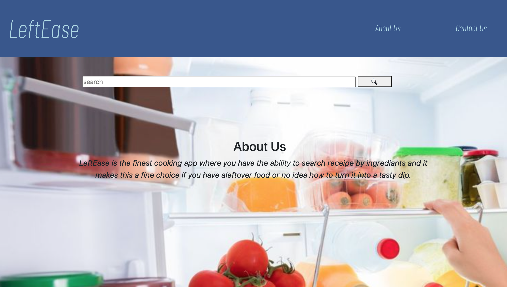
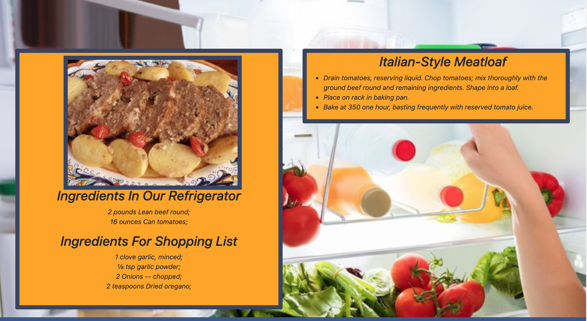

# Title: LeftEase

# Purpose: 
As a user who struggles to come up with something to cook for dinner, I want a simple, easy to use app 
where i can type in a few ingredients that are in my fridge, and it will randomly generate both a recipe,
AND a shopping list of ingredients I will need at the store, so that I can make creative new dinners without
having to think about what to make!

# Instructions:
At the landing page, simply type in a list of ingredients that you have in your Refridgerator that you want to use in a recipe into the input field. Hit enter, or click search, and Left-Ease will generate a unique recipe for you along with a shopping list of ingredients you will need that you don't already have. 

# Built Using:
- HTML
- CSS
- Javascript
- Bootstrap styling
- Google Fonts API
- Spoonacular API

# Screenshots:

# Link to Page: 

https://trumore.github.io/Updated-Project-1/

